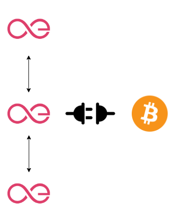

# Hyperchains Playground 🕹️

  

The [Hyperchains](https://github.com/aeternity/hyperchains-whitepaper) playground provides an isolated environment for Hyperchains node operators with intention to develop their operational skills before Hyperchains release stage. 

The deployment is based on [docker-compose](https://docs.docker.com/compose/) setup that runs a Bitcoin node and three [Aeternity](https://github.com/aeternity/aeternity) Hyperchains nodes with predefined configurations.

<p align="center">
  
    <br>
    <em>Deployment schema</em>
</p>

# How to start

Make sure you have Docker [installed](https://docs.docker.com/engine/install/) and running, and then follow these instructions to run the Hyperchains playground:

#### 1. Clone the repo:
```bash
git clone https://github.com/aeternity/hyperchains_playground.git
```

#### 2. Setup activation criteria:
```
```

#### 3. Configure Bitcoin wallet:
```
```

#### 4. Run the network:
```bash
docker-compose up -d
```

#### 5. Deploy an election contract on predefined address:

```
```

#### 6. Mine PoW blocks
```
```

#### 7. Switch to the new consensus and produce Hyperchains blocks
```
```

#### 8. Stop the network
```bash
docker-compose down
```

<p align="center">
  
</p>

## Configuration notes

The nodes use the `mean15-generic` miner (fastest generic miner).
As the beneficiary key-pair is publicly available, this setup should *not* be connected to public networks.

All local network nodes are configured with the same beneficiary account (for more details on beneficiary see [configuration documentation](https://github.com/aeternity/aeternity/blob/master/docs/configuration.md#beneficiary-account)):
- public key: ak_twR4h7dEcUtc2iSEDv8kB7UFJJDGiEDQCXr85C3fYF8FdVdyo
- private key secret: `secret`
- key-pair binaries can be found in `/node/keys/beneficiary` directory of this repository

By default the localnet has set default mine rate of 1 block per 15 seconds.
It can be changed by setting `AETERNITY_MINE_RATE` environment variable.
The variable is in milliseconds, so to set 1 block per 10 seconds use:

```bash
AETERNITY_MINE_RATE=10000 docker-compose up
```
